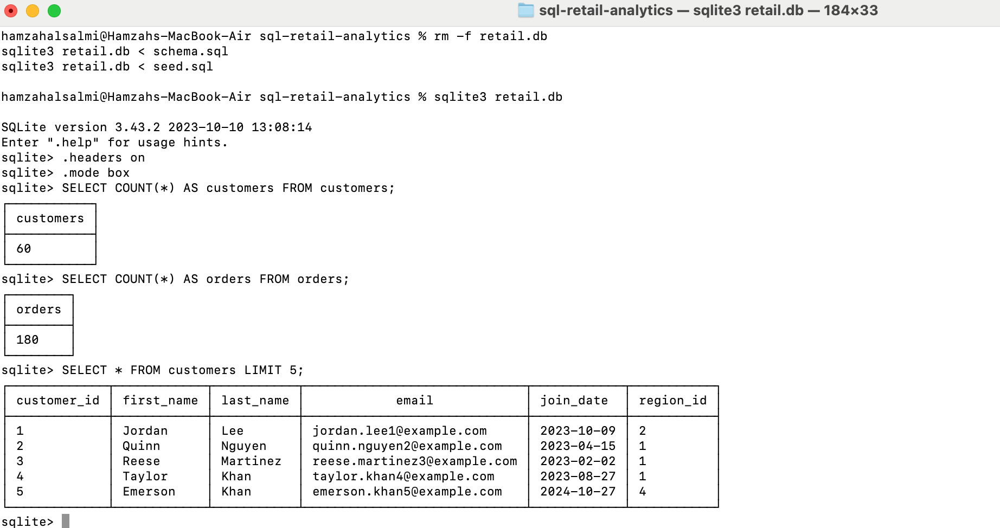
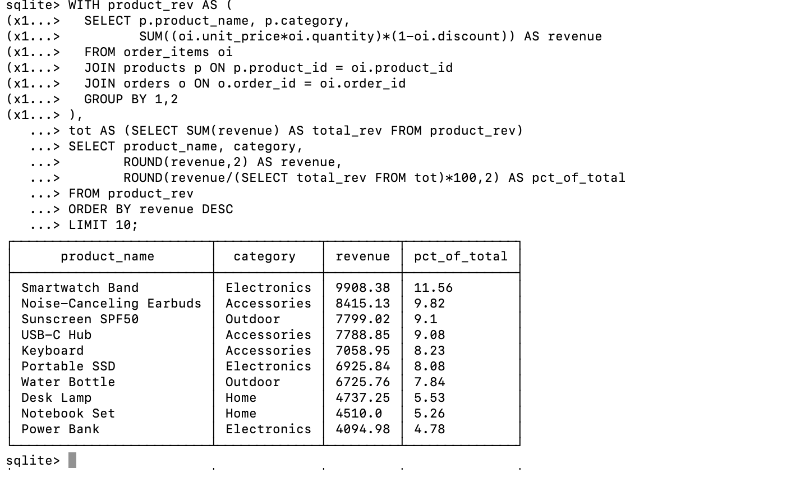

# SQL Retail Analytics

A simple SQL project analyzing a fictional retail dataset.  
Includes schema, sample data, and queries to answer key business questions.

---

## Files
- `schema.sql` → database tables  
- `seed.sql` → sample data  
- `queries/analysis.sql` → analysis queries  

---

## How to Run
```bash
# SQLite
sqlite3 retail.db < schema.sql
sqlite3 retail.db < seed.sql
sqlite3 -header -csv retail.db < queries/analysis.sql > results.csv
Insights
Queries cover:

Top customers & revenue trends

Product sales ranking

Average order value by region

Repeat purchases & retention

Discount impact

Purpose
Built as a portfolio project to showcase SQL skills in data modeling, joins, CTEs, and business analysis.


---


## Screenshots

**SQLite overview**



**Top products by revenue**


